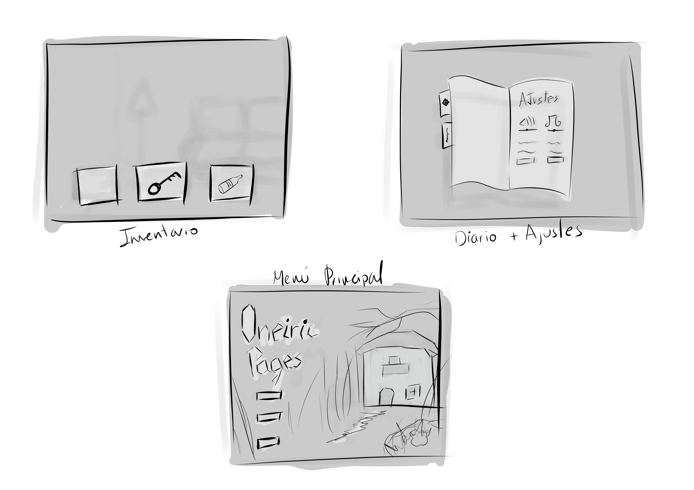

# Oneiric Pages GDD

> _Presta atención en el día para poder escapar de tus pesadillas._

## Historia

Tu abuelo ha muerto y tu familia y tú os habéis mudado a su casa. Durante la limpieza y la mudanza descubres un **diario** antiguo de tu abuelo mediante el cuál entenderás el motivo de tus pesadillas.

## Características

Explorar la casa, completar minijuegos, encontrar pistas, resolver puzles, sobrevivir la noche.

## Género

Horror psicológico.

## Jugabilidad

El juego transcurre en un ciclo de _día y noche_, durante el día debes explorar para encontrar pistas que te ayudaran a resolver los puzzles de la noche.

- Explorar la casa interactuando con objetos de tu alrededor.
- Minipuzles como parte de la historia (Ej: miedo al mar = pesadilla de ahogamiento).
- Diario del abuelo: pistas de los puzzles que te puedes encontrar.
- Interacciones: Comer, recoger cajas, barrer, gestión inventario
- Inventario de objetos. Puedes recoger cosas durante la exploración del día y usarlas durante la noche.
- Personaje secundario que te guía si necesitas ayuda. (Gato)

## Unique Selling Points

- Lo que hagas durante el día afecta a la noche.
- Descubre la historia que existe detrás de tus pesadillas.
- Despiérteate.
- Experiencia inmersiva en primera persona, con estética retro PS1 y efectos CRT.

## Estilo artístico

Low poly, gráficos estilo PS1, efectos CRT

UI Mockup

Inventario de objetos, diario con menú integrado, menú principal (cargar partida, partida nueva, opciones, salir)

## Categoría

Indie, simulación 3D, singleplayer, primera persona, puzzles, exploración, escape room.

## Juegos similares

Granny, Chilla's Art, Amnesia, Ghost town pumpkin festival

## Público objetivo

Jóvenes entre 18 y 25 años, especialmente streamers y jugadores de nicho.

## Plataformas objetivo

Se elige **PC** como plataforma principal por varias razones:

- El público objetivo (jóvenes y streamers) juega principalmente en PC.
- El corto tiempo de desarrollo no permite adaptaciones para consolas.
- Permite usar teclado y ratón para exploración precisa y control cómodo del inventario.

## Características técnicas

- Compatible con **teclado, ratón y mando**
- Gráficos _low poly_ y efectos CRT de bajo consumo, garantizando **alto rendimiento** incluso en equipos modestos.
- Almacenamiento local con **hasta 3 partidas guardadas** simultáneamente.

## Ventajas y limitaciones

**Ventajas:**

- Ejecución sencilla para pruebas internas.
- Gran flexibilidad en actualizaciones y parches.
- Controles precisos para puzzles y minijuegos.
- Distribución simple: permite compartir el juego con los jugadores finales mediante plataformas como Steam, itch.io o descarga directa.

**Limitaciones:**

- No aprovecha características específicas de consolas.
- Sin consola, se pierde la exposición de plataformas de entretenimiento masivo.
- Distribución dependiente de plataformas digitales sin presencia física.
- Poco tiempo de desarrollo al ser pensado para una gamejam

## Adaptaciones necesarias

