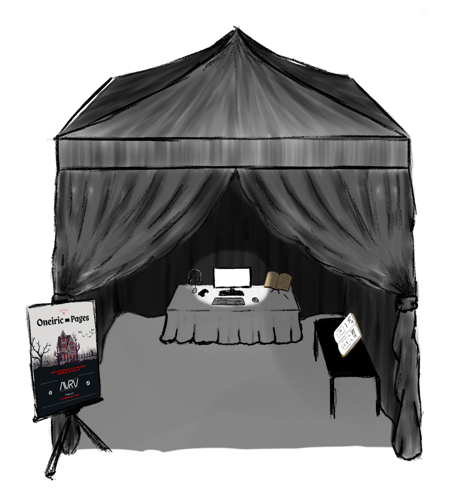
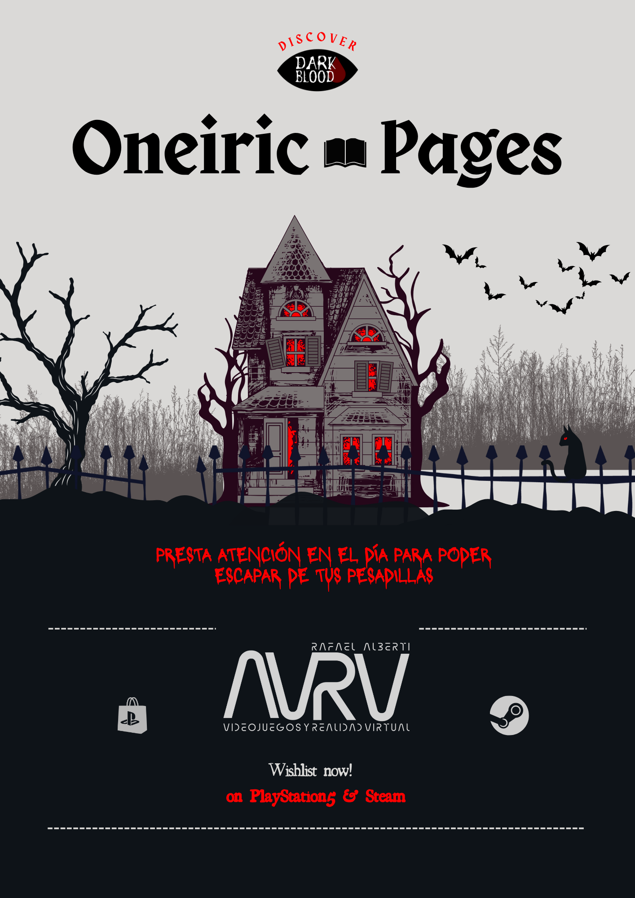

# Presentación en sociedad

## Eventos
DarkBlood tiene como objetivo llevar Oneiric Pages a algunos de los eventos más relevantes del panorama indie y de videojuegos a nivel internacional. Cada uno ofrece una oportunidad única de conectar con públicos distintos y mostrar el potencial del estudio.

- IndieDevDay: Encontrar fans del horror en una convención indie española con invitados globales
- Tokyo game show: Acceso al público japonés
- Dreamhack Atlanta (Indie Playground): Acceso al público estadounidense
  

Algunas organizaciones ofrecen su espacio para el montaje de un stand mediante la participación vía talleres, charlas o exposiciones como alternativa al pago en metálico. Por lo que se proponen diferentes talleres relacionados con la temática del videojuego:

  - Taller sobre la relevancia de los monstruos en su periodo histórico.
  - Taller sobre perspectiva de género en videojuegos.
  - Taller práctico sobre diseño y modelaje 3D de monstruos populares. 

  

## Stand y Marketing
El stand de DarkBlood busca ofrecer una experiencia más allá de la pantalla:
- Una carpa oscura que aísla la luz del exterior para una inmersión total.
- Un diario físico inspirado en el del juego, que los visitantes pueden hojear y dejar sus propias notas.
- Caracterización del staff de los personajes del videojuego
- Un peluche o figura del gato, la guía del jugador dentro del juego.
- El artbook en físico.
- Una serie de puzles, acertijos y rompecabezas para la integración del tema en los clientes.

Todo el conjunto está pensado para atraer tanto a curiosos como a fans del género, fomentando la participación y el boca a boca dentro del evento.
  

*Boceto del stand de DarkBlood* - Ilustrado por Samuel Urbina Flor
  

*Diseño del flyer promocional de “Oneiric Pages”* - Diseñado por Paula Rumeu Romero

  

## Nota de prensa
La nota de prensa servirá como carta de presentación del estudio y del proyecto ante medios, organizadores y público.
En ella se resumen los puntos clave de Oneiric Pages, su propuesta narrativa y el enfoque artístico del equipo.

