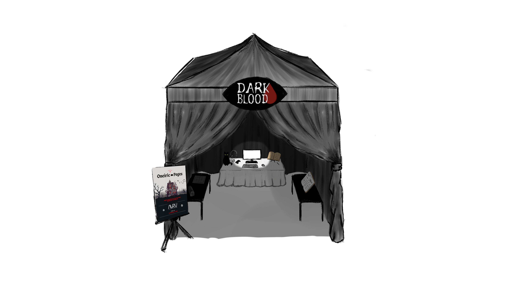

# Presentación en sociedad

## Eventos

> Imaginad que vais a presentar vuestro proyecto de videojuegos en diferentes eventos. Buscad información sobre los próximos que van a realizarse y seleccionad tres eventos que creéis relevantes, ya sea por la temática o el público objetivo.

- IndieDevDay: Encontrar fans del horror en una convención indie española con invitados globales
- Tokyo game show: Acceso al público japonés
- Dreamhack Atlanta (Indie Playground): Acceso al público estadounidense

### Stand

.
## Ideas únicas

> Pensad también diferentes ideas originales (al menos tres) para promocionar vuestro videojuego en el stand y atraer a posibles compradores o inversores.

- Burbuja donde jugar que oscurece todo
- Prop diario con garabatos turbios e incitación a escribir
- Nos vestimos de personajes y asustamos
- Peluche de gato

## Nota de prensa

> Elaboraréis una nota de prensa, de al menos 200 palabras, para entregar a los periodistas que os visiten. Recordad indicar toda la información relevante y no os olvidéis de incluir vuestros Unique Selling Points.

## Discurso

> Por último, prepararéis un discurso de máximo sesenta segundos vendiendo la idea de vuestro juego y sus características principales, tal y como haríais si tuviéseis la oportunidad de presentarlo frente a grupos de inversión. Lo expondréis en clase al finalizar.
